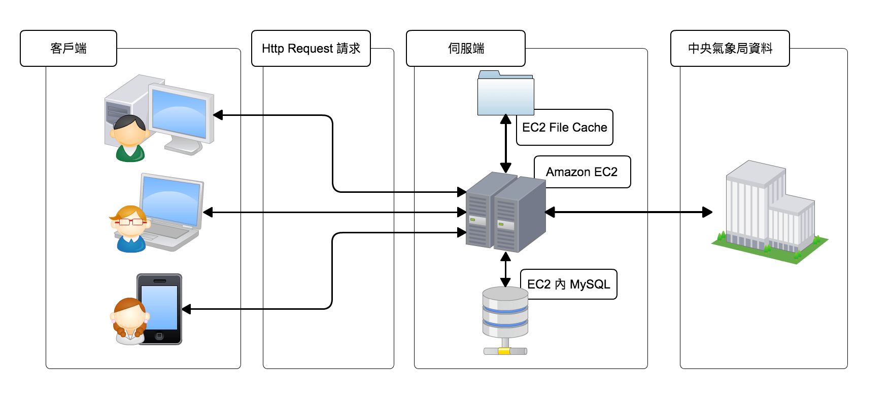
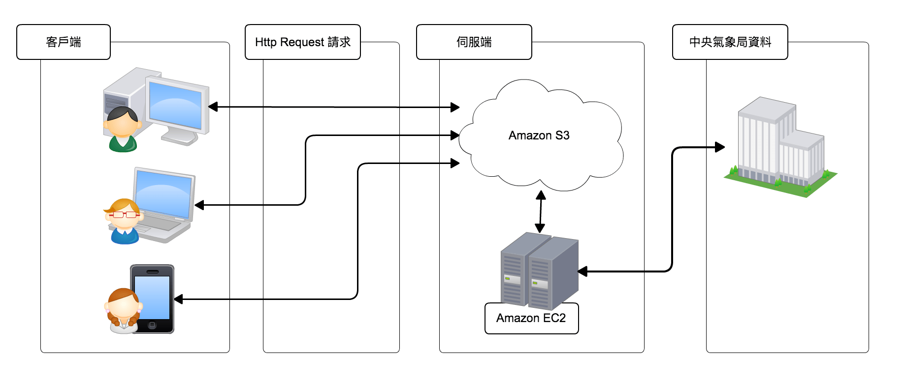
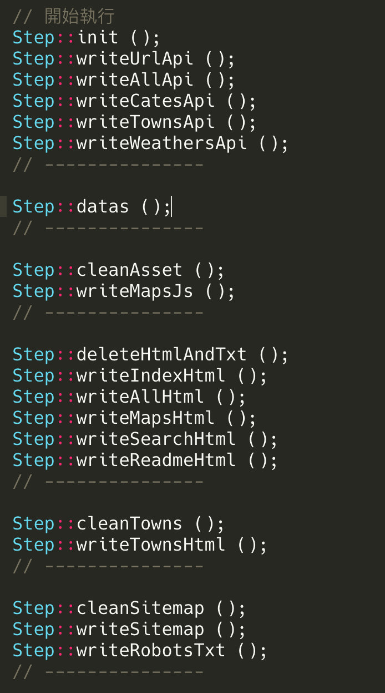
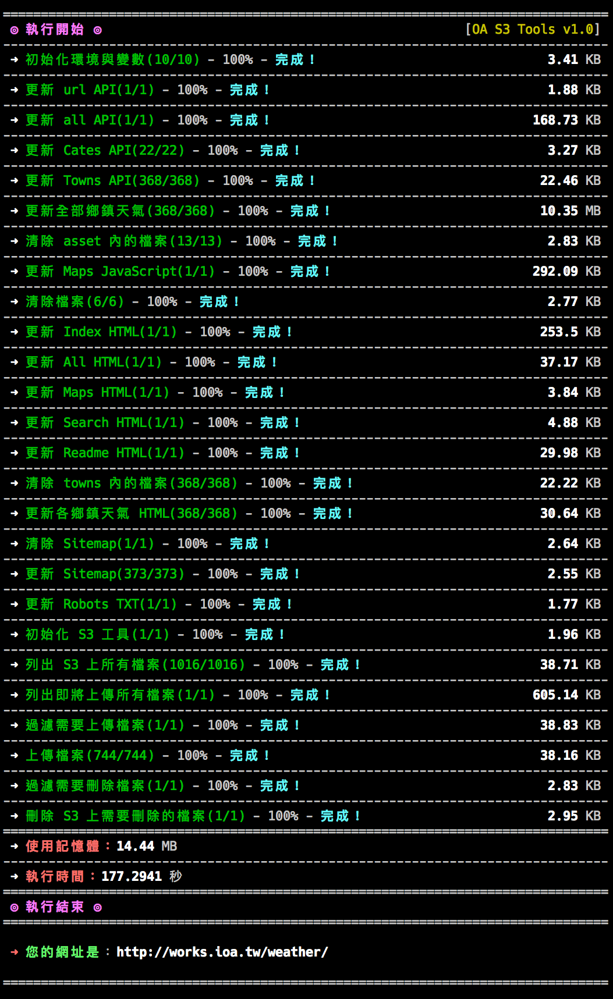
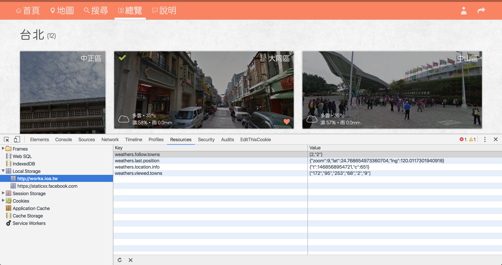
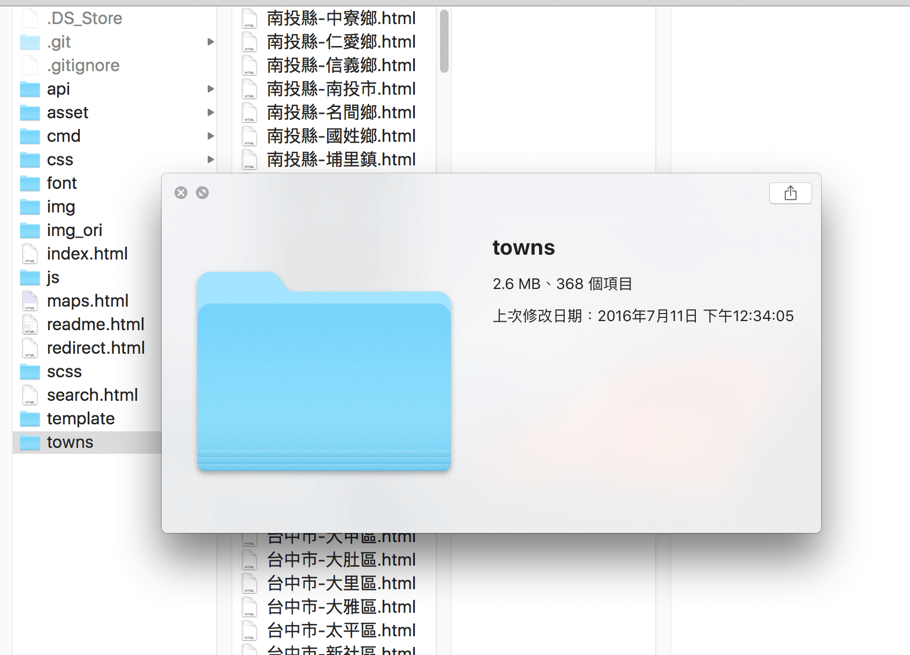

# Welcome to Weather Maps!
想查詢每個地方的天氣嗎？藉由 Google Maps API 的地圖服務，以及中央氣象局的天氣預報，讓你快速輕鬆的查詢台灣 368 個鄉鎮的天氣概況！使用中央氣象局網站公告的氣象預報資訊作為資料來源，平均每 30 分鐘更新最新天氣概況，分別顯示溫濕度、日出落時間、特別預報..等功能。

---

 
## 聲明
* 本作品授權採用 姓名標示-非商業性 2.0 台灣 (CC BY-NC 2.0 TW) 授權，詳見 [https://creativecommons.org/licenses/by-nc/2.0/tw/](https://creativecommons.org/licenses/by-nc/2.0/tw/) 
* 網頁內容資料主要參考[中央氣象局網站](http://www.cwb.gov.tw/)所公佈之內容建置，其內容預報僅供參考，更多詳細氣像概況可至中央氣象局查詢，一切天氣資訊以氣象局為準喔！

 
## 作品分享
* GitHub：[https://github.com/comdan66/weather/](https://github.com/comdan66/weather/)
* Demo：[http://works.ioa.tw/weather/](http://works.ioa.tw/weather/)
* 更多作品：[http://www.ioa.tw/](http://www.ioa.tw/)
* API 文件：[http://works.ioa.tw/weather/api/doc/](http://works.ioa.tw/weather/api/doc/)

 
## 重點整理
* 藉由 [Google Maps JavaScript API v3](https://developers.google.com/maps/documentation/javascript/) 的地圖服務，以及中央氣象局網站的天氣預報所實作的天氣地圖！
* 基本上是利用 Google Maps API 的 [Maps](https://developers.google.com/maps/documentation/javascript/tutorial) 以及 [Marker](https://developers.google.com/maps/documentation/javascript/markers) 設計！
* 附加使用 [MarkerWithLabel](http://google-maps-utility-library-v3.googlecode.com/svn/tags/markerwithlabel/1.1.8/docs/examples.html) 在地圖上顯示各區域的天氣圖示，以加強 Google Maps 上的圖像表現。
* 參考[中央氣象局手機版本網頁](http://www.cwb.gov.tw/m/)所提供的資料建置。
* 全網站使用[響應式網站設計(RWD)](http://www.ibest.tw/page01.php)，所以手機也可以正常瀏覽。
* 搭配 [LocalStorage](https://developer.mozilla.org/en-US/docs/Web/API/Window/localStorage) 實作[追蹤天氣](http://works.ioa.tw/weather/URL_INDEX)、紀錄瀏覽、[記錄上次地圖位置](http:/works.ioa.tw/weather/URL_MAPS).. 等功能。
* 網站內容使用 [navigator.geolocation](https://developer.mozilla.org/zh-TW/docs/Using_geolocation) 物件取得前端 GPS 位置，新版 Chrome 必須是 Https 下才可使用。
* [搜尋功能](http://works.ioa.tw/weather/URL_INDEX)則使用 [Google Maps Geocoding API](https://developers.google.com/maps/documentation/geocoding/intro) 將住址搜尋更加準確化。
* 使用 [Static Maps API](https://developers.google.com/maps/documentation/staticmaps/intro) 以及 [Street View Image API](https://developers.google.com/maps/documentation/streetview/intro) 所提供的服務，擷取地點的地圖、街景截圖。
* 感謝 [宙思設計](http://www.zeusdesign.com.tw/) 提供的可愛天氣小圖示，感謝 [Monkeyy78](https://www.flickr.com/photos/lifegoseon) 提供景點照片。
* 前端開發工具主要使用 [Gulp](http://gulpjs.com/)、[Compass](http://compass-style.org/) 加強開發效率，並使用 [JavaScript](http://compass-style.org/)、[jQuery](https://jquery.com/) 實作前端功能效果。
* 專案整體主要框架使用 [OAF2E](https://github.com/comdan66/oaf2e) [v3.3](https://github.com/comdan66/oaf2e/tree/version/3.3)。
* 後端語言為 [php](http://php.net/)，關鍵程式碼在 `/cmd/put.php`，GitHub 位置在[這裡](http://php.net/)。
* 系統使用 [Amazon S3](https://aws.amazon.com/tw/s3/) 服務，利用 php 執行完更新後，在將相關網頁檔案部署至 S3 服務。
* JavaScript uglify 使用 [jsmin-php](https://github.com/rgrove/jsmin-php/)，css、HTML minify 則是使用 [preg_replace](http://php.net/manual/en/function.preg-replace.php) 函式。
* 天氣概況一併整理成公開 [json](https://zh.wikipedia.org/wiki/JSON) 格式的 [API](http://works.ioa.tw/weather/api/doc/) 分享，並且使用 [apiDoc](http://apidocjs.com/) 說明使用方式。
* 加入部分的 [schema](https://schema.org/)、[Google AMP](https://www.ampproject.org/docs/get_started/about-amp.html)、[JSON-LD](http://json-ld.org/) 的結構，並且加強 [SEO](https://zh.wikipedia.org/zh-tw/%E6%90%9C%E5%B0%8B%E5%BC%95%E6%93%8E%E6%9C%80%E4%BD%B3%E5%8C%96) 的優化。
* 使用 [維基百科(wikipedia)](https://zh.wikipedia.org/wiki/%E7%BB%B4%E5%9F%BA%E7%99%BE%E7%A7%91) 的 [API](https://www.mediawiki.org/wiki/API:Main_page) 將各個鄉鎮地方的簡介、歷史資訊與鄉鎮內頁合併，讓整體網站功能更加多元，在瀏覽全台各地時，可以更加的對各個地方有所認識！。

 
## 實作說明

天氣地圖 Weather Maps 其實約莫在去年這時候第一、二版完成，然後一直放在 Amazon EC2 讓它獨立的運作，直到這幾週才有空再將他修改一下，這次修改不僅對版型做翻新，也對系統面做修改！

上一版架構基本上就是典型的後端伺服器吐出 API 處理架構，藉由一台 EC 定時地去取得最新天氣資訊，在存入資料庫然後提供 API。運行一年下來，其實無論是流量、記憶體亦或者資料庫都會佔走 EC2 一項固定的資源（因為 [Amazon RDS](https://aws.amazon.com/tw/rds/) 對我來說有點貴..，所以我的資料庫是安裝在 EC2 上的），而這項卻是固定要做的事，尤其是圖片檔案與 API 流量！為了減低 EC2 的負擔以及加強 [Search Engine Optimization(SEO)](https://zh.wikipedia.org/zh-tw/%E6%90%9C%E5%B0%8B%E5%BC%95%E6%93%8E%E6%9C%80%E4%BD%B3%E5%8C%96)，於是我開始進行對天氣地圖作品的修改。

有鑒於我近期與 [Amazon S3](https://aws.amazon.com/tw/s3/) 變得比較熟了，所以把腦筋動到了 S3 上，因為看 S3 有**安全**、**耐久**、**可高度擴展**的[雲端儲存](https://aws.amazon.com/tw/what-is-cloud-storage/)特性，索性就以 S3 為主 EC2 為輔，不用資料庫，而是將資料轉乘 Json 的格式，再用資料夾結構的放置，通通上傳至 S3 上！如此一來前端所有資源從原本的向 EC2 索取，變成改從 S3 上取得，大大地減低天氣的 Request 數量，API Request 不說，光圖片、靜態檔案就少了很多流量，同時資料庫也減輕一部份的負擔！唯一會需要後端的部分，就只剩下固定時間更新資料的後端處理部分，而這部分也只會耗費不到 15MB 的記憶體，所以負擔不算大。

  
▲ 上一版的架構會造成大量的 Request 都往伺服器索取，所以會對伺服器造成一部份的負擔。
 

  
▲ 因為 Amazon S3 安全、耐久、可高度擴展的雲端儲存特性，於是將架構調整成以 S3 為主 EC2 為輔的架構，以減緩 EC2 伺服器的負擔。
 
 

後端處理的關鍵程式是 `/cmd/put.php` 這隻，基本上流程是 定義基本常數、取得最新的天氣資訊、寫入 API Json 檔案、產生相關的 HTML 檔案、列出 S3 上檔案、比對新舊檔案、刪除、上傳 S3、完成。其中在產生 HTML、JavaScript 時，會進行 minify 與 uglify，css 則是使用了 Compass 編譯 Scss，最後再依個別 HTML Merge css、JavaScript，並以 [MD5](https://zh.wikipedia.org/zh-tw/MD5) 內容後為檔名（以 md5 檔名取代版本號，當內容有更新時會有不同新檔名，以防止前端瀏覽器快取問題，細節可參考[此篇](http://www.infoq.com/cn/articles/front-end-engineering-and-performance-optimization-part1)），如此一來便可以加強前端傳輸效能與壓縮檔案大小！

前端部分因為會隨著天氣更新而產生新的 HTML 檔案，這部份剛好可以針對此架構加強 SEO 的調整優化，當然大家都知道的 sitemap、robots.txt 都有一定會有，但這次還加入部分的 [schema](https://schema.org/)、[Google AMP](https://www.ampproject.org/)、[JSON-LD](http://json-ld.org/) 的結構，這些步驟都是去餵搜尋引擎想吃的菜，好盡可能達到所有可能的曝光與分享！原本上一版有使用 [navigator.geolocation](https://developer.mozilla.org/zh-TW/docs/Using_geolocation) 物件取得前端 GPS 位置以增加更多的趣味性，但因為隨著 Chrome 的更新，要使用 navigator.geolocation 則必須使用 [https](https://zh.wikipedia.org/wiki/%E8%B6%85%E6%96%87%E6%9C%AC%E4%BC%A0%E8%BE%93%E5%AE%89%E5%85%A8%E5%8D%8F%E8%AE%AE) 的協定（詳情可看[此篇](https://developers.google.com/web/fundamentals/native-hardware/user-location/obtain-location)），所以這功能在 Chrome 上就無法使用，不過其他瀏覽器應該還可以用！

前端功能中有使用到 [LocalStorage](https://developer.mozilla.org/en-US/docs/Web/API/Window/localStorage) 作為暫存的機制，利用這項前端瀏覽器的功能，我將它拿來記錄使用者瀏覽過的鄉鎮，同時也可以拿來做為收藏鄉鎮的功能。在地圖上更可以藉由讀取 LocalStorage 來實作記錄上次的地圖位置，而上一段所提到的 navigator.geolocation 取得客戶端 GPS 位置，也可以利用 LocalStorage 來實作 Cache 的機制，而這些功能程式碼我都放置在 `/weather/js/public.js` 內，各位若有興趣歡迎[點開](https://github.com/comdan66/weather/blob/master/js/public.js)來看喔！

  
▲ 藉由 Step 物件，分步驟地將天氣更新，寫入 API，產生 HTML，上傳 S3，達成部署更新天氣的步驟！ 

  
▲ 基本上流程是 定義基本常數、取得最新的天氣資訊、寫入 API Json 檔案、產生相關的 HTML 檔案、列出 S3 上檔案、比對新舊檔案、刪除、上傳 S3、完成。
 
 

此新版的天氣地圖除了使用中央氣象局的資訊外，此次也使用 [維基百科(wikipedia)](https://zh.wikipedia.org/wiki/%E7%BB%B4%E5%9F%BA%E7%99%BE%E7%A7%91) 的 [API](https://www.mediawiki.org/wiki/API:Main_page) 將各個鄉鎮地方的簡介、歷史資訊下載下來，並且整理分類，再產生 HTML 的鄉鎮內頁時一併加入簡介，讓整體網站功能更加多元，在瀏覽全台各地時，可以更加的對各個地方有所認識！而各個鄉鎮的照片，則是利用 Google Maps 提供的街景服務，取得該鄉鎮的隨機街景截圖，若是取得失敗則使用 Google Maps 的截圖。

程式裡面會使用到上傳 S3 的功能，所以在執行時特別設計成 Cli 執行，配合下參數的方式，所以可以上傳至不同的 S3 Bucket。部署至 S3 的方式是進入專案 **`/cmd/`** 目錄內，下指令 `php put.php -b {Bucket Name} -a {Access Key} -s {Secret Key}` 即可按照步驟做更新、上傳的流程，-b 代表要上傳的 S3 Bucket 名稱，-a 是 Access Key，-s 是 Secret Key，若是不想上傳的話則有 代表 upload 的 -u 參數可決定是否上傳，若是不想上傳則加入 `-u 0` 的參數即可，而 -m 則代表 minify，-d 為是否更新天氣；-u、-m、-d 的預設值皆為 1。

另外在 cmd 目錄內還有兩隻 php 檔案，分別是 **init.php**、**clean.php**，因為專案內有很多資料夾或者檔案是被 Git Ignore 的，所以需要 init.php 來幫你建立這些檔案、目錄，一樣進入專案 `/cmd/` 目錄內，下指令 `php init.php` 後即可產生所需的目錄與檔案！而 clean.php 是用來清除被 Git Ignore 的目錄與檔案，執行方式與 init.php 相同喔！

  
▲ 搭配 LocalStorage 實作追蹤天氣、紀錄瀏覽、記錄上次地圖位置.. 等功能。
 

  
▲ 編譯完後的各個鄉鎮內頁 HTML
 

  
▲ 將整理過後的 Json 一起上傳 S3，變成公開的 API，同時也提供 apiDoc，如此一來大家就可以一起使用我的資源，取之於網路 分享於網路，所以在我還沒有關閉我的服務之前，大家都可以使用喔！
 
 

最後！既然做成 S3 架構也有了 API 服務，既然取之於網路，那就一樣分享於網路，所幸我就連 [apiDoc](http://works.ioa.tw/weather/api/doc/) 一起建立，如此一來大家就可以一起使用我的資源，在我還沒有關閉我的服務之前，大家都可以使用喔！以上就是我的天氣地圖 Weather Maps 的架構改版心得，若大家想看更多有關於我的作品，歡迎至[我的個人網頁](http://www.ioa.tw/)逛逛！然後各位若喜歡此專案的話，可以到我的 [GitHub](https://github.com/comdan66/weather) 上幫我按個喜歡喔！
